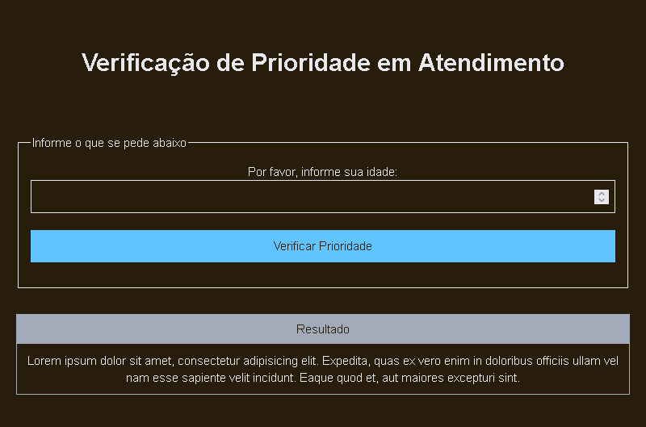

# DESAFIO 1. QUESTÃO 2

## Problemática

2. Suponha que você trabalha em um centro de atendimento e foi solicitado um programa que peça ao usuário que informe a sua idade e, em seguida, verificar se ele é um adulto ou idoso, para gerar a prioridade em atendimento. Crie um programa que se a pessoas tiver 60 anos ou mais imprima na tela “Aguarde na fila de prioridade”, caso contrário “Aguarde na fila normal”.

## Resolução: Verificação de Prioridade em Atendimento

Para resolver o segundo desafio, criei um arquivo HTML simples que solicita a idade do usuário e, com base na idade fornecida, determina se o usuário é um adulto ou idoso, exibindo uma mensagem apropriada. Vamos também incluir um pouco de CSS para estilizar a página e um script JavaScript para implementar a lógica do programa.


* Foi desenvolvido a versão simplificada da resolução em: [./index-simples.html](./index-simples.html)
* e a versão melhorada em: [./index.html](./index.html)
* Abaixo uma imagem do resultado final da problemática 2 (depois das melhorias)



### Estrutura HTML

O arquivo HTML contém um campo de entrada para a idade do usuário, um botão para acionar a verificação de prioridade e um parágrafo para exibir o resultado.

```html
<!DOCTYPE html>
<html lang="pt-br">
<head>
    <meta charset="UTF-8">
    <title>Verificação de Prioridade em Atendimento</title>
    <!-- <link rel="stylesheet" href="style.css"> -->
</head>
<body>
    <h1>Verificação de Prioridade em Atendimento</h1>
    <p>Por favor, informe sua idade:</p>
    <input type="number" id="idade" min="0">
    <button onclick="verificarPrioridade()">Verificar Prioridade</button>
    <p id="resultado"></p>
    <!-- <script src="script.js"></script> -->
</body>
</html>
```

### Estilo css

> Para o estilo css vou utilizar um template que já tenho utilizado em outros projetos meus, de DEV para DEV. Irei utilizar o terminalcss, o como usar está disponível no terminalcss.xyz. Ele possui um estilo css inspetado no terminal (linha de comando), e será nosso ponto de partida para as estilizações. Com ele vamos nos preocupar apenas com a lógica e com o html.

> eu já tenho utilizado ele e feito diversas melhorias, compilei o que é necessário da estilização para este e os próximos desafios na pasta [📁/common/css](/common/css)

basicamente para utilizar nosso css comum basta importar ele no header com o seguinte codigo

```html
<head>
    ...
    <link rel="stylesheet" href="/common/css/style.css" />
    ...
</head>
```

### Lógica JavaScript

A lógica do JavaScript está implementada na tag `script` no próprio HTML. Na lógica utilizamos apenas uma função personalizada, chamada `verificarPrioridade()` que é acionada pelo botão em tela.

#### Função `verificarPrioridade()`

A função `verificarPrioridade()` é chamada quando o usuário clica no botão. Ela verifica a idade fornecida e exibe a mensagem de prioridade de atendimento apropriada.
 
```js
function verificarPrioridade() {
    const idade = document.getElementById('idade').value;
    const resultado = document.getElementById('resultado');

    if (idade >= 60) {
        resultado.textContent = "Aguarde na fila de prioridade.";
    } else {
        resultado.textContent = "Aguarde na fila normal.";
    }
}

```


### Resolução da problemática

A solução completa inclui o HTML, CSS e JavaScript necessários para implementar o programa. O usuário pode inserir sua idade e, ao clicar no botão, o programa determinará se ele deve aguardar na fila de prioridade ou na fila normal, exibindo a mensagem apropriada.

O código da resolução encontra-se em [./index-simples.html](./index-simples.html)


### TESTE da solução SIMPLIFICADA (em iframe)

Você pode visualizar em tela cheia abrindo o arquivo [./index-simples.html](./index-simples.html)

<iframe
    style="width: 100%; min-height: 500px; border-radius: 25px; border: 2px dashed black;"
    src="index-simples.html"
></iframe>

## MELHORIAS

Utilizando recursos definidos no `terminalcss`, melhorei a organização das informações em tela.

* Colocando o resultado em um card
* Separando a parte de entrada da parte de Saida de informações

### O Resultado final

O código final abaixo encontra-se em [./index.html](./index.html)

```html
<!DOCTYPE html>
<html lang="pt-br">

<head>
    <meta charset="UTF-8">
    <title>Verificação de Prioridade em Atendimento</title>
    <link rel="stylesheet" href="/common/css/style.css" />
    <!-- <link rel="stylesheet" href="style.css"> -->
</head>

<body>
    <h1>Verificação de Prioridade em Atendimento</h1>
    <fieldset>
        <legend>Informe o que se pede abaixo</legend>
        <div class="form-group">
            <label for="idade">Por favor, informe sua idade:</label>
            <input type="number" id="idade" min="0">
        </div>
        <button class="btn btn-primary btn-block" onclick="verificarPrioridade()">Verificar Prioridade</button>
    </fieldset>
    <section>
        <div class="terminal-card" id="card">
            <header>Resultado</header>
            <div id="resultado">
                Lorem ipsum dolor sit amet, consectetur adipisicing elit. Expedita, quas
                ex vero enim in doloribus officiis ullam vel nam esse sapiente velit
                incidunt. Eaque quod et, aut maiores excepturi sint.
            </div>
        </div>
        <br>
    </section>
</body>
<!-- <script src="script.js"></script> -->
<script>
    function verificarPrioridade() {
        const idade = document.getElementById('idade').value;
        const resultado = document.getElementById('resultado');

        if (idade >= 60) {
            resultado.textContent = "Aguarde na fila de prioridade.";
        } else {
            resultado.textContent = "Aguarde na fila normal.";
        }
    }
</script>

</html>

```

### e em iframe para testar a solução final

Você pode visualizar em tela cheia abrinco o arquivo [./index.html](./index.html)

<iframe
    style="width: 100%; min-height: 800px; border-radius: 25px; border: 2px dashed black;"
    src="./index.html"
></iframe>
