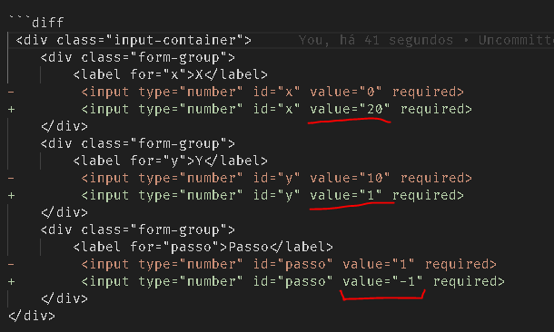

# DESAFIO 1. QUESTÃO 5

## Problemática

5. Suponha que o seu primo tenha interesse em produzir um algoritmo que imprima os números de 20 até 1 em ordem decrescente e pediu ajuda a você. Como você implementaria esse algoritmo?

## Resolução: 

Pegar o código final do desafio 4, e ajustar `x para 20`, `y para 1` e `passo para -1`

### linhas modificadas apenas no html:

* diff_das_modificações na imagem abaixo, caso o md diff não seja bem renderizado

* diff md:

```diff
 <div class="input-container">
    <div class="form-group">
        <label for="x">X</label>
-        <input type="number" id="x" value="0" required>
+        <input type="number" id="x" value="20" required>
    </div>
    <div class="form-group">
        <label for="y">Y</label>
-        <input type="number" id="y" value="10" required>
+        <input type="number" id="y" value="1" required>
    </div>
    <div class="form-group">
        <label for="passo">Passo</label>
-        <input type="number" id="passo" value="1" required>
+        <input type="number" id="passo" value="-1" required>
    </div>
</div>

```

> Nada alem do apresenrado acima foi modificado em releção ao deasfio 4, (desconsiderando o titulo e problematica do desafio)

----
----

## O Resultado final

```html
<!DOCTYPE html>
<html lang="pt-br">

<head>
    <meta charset="UTF-8">
    <title>Impressão de Números de 20 a 1</title>
    <link rel="stylesheet" href="/common/css/style.css" />
    <style>
        input {
            text-align: center;
        }

        .input-container {
            display: flex; 
            gap: 21px;
            justify-content: space-evenly;
        }
    </style>
</head>

<body>
    <div class="terminal-alert terminal-alert-primary">
        <legend>DESAFIO 1 - PROBLEMÁTICA 5</legend>
        <p>
            5. Suponha que o seu primo tenha interesse em produzir um algoritmo que imprima os números de 20 até 1 em ordem
            decrescente e pediu ajuda a você. Como você implementaria esse algoritmo?
        </p>
    </div>
    <h1>Impressão de Números de X=20 a y=1 e passo= -1</h1>
    <fieldset>
        <legend>Se quiser, ajuste os valores de X, Y e passo</legend>
    
        <div class="input-container">
            <div class="form-group">
                <label for="x">X</label>
                <input type="number" id="x" value="20" required>
            </div>
            <div class="form-group">
                <label for="y">Y</label>
                <input type="number" id="y" value="1" required>
            </div>
            <div class="form-group">
                <label for="passo">Passo</label>
                <input type="number" id="passo" value="-1" required>
            </div>
        </div>
        <button class="btn btn-primary btn-block" onclick="IniciarContagem()">Iniciar contagem</button>
    </fieldset>
    <section>
        <div class="terminal-card" id="card">
            <header>Resultado</header>
            <div id="resultado" style="font-size: xx-large; padding: 2rem 3rem;">
                aqui será inserido a contagem...
            </div>
            <div id="acumulador" style="padding:2rem">
                
            </div>
        </div>
    </section>
</body>
<script>

    var gerador;
    var acumulador = []

    function* range(inicio, fim, passo = 1) {
        let current = inicio
        
        while (inicio < fim ? current < fim : current > fim){
            yield current
            current += passo
            console.log(current)
        }
        return fim
    }

    function imprimirProximoNumero() {
        // for (const value of range(0, 5)) 
        var numero_gerado = gerador.next()
        acumulador.push(numero_gerado.value)
        document.getElementById('resultado').textContent = numero_gerado.value;
        document.getElementById('acumulador').textContent = acumulador.toString();
       
        if (!numero_gerado.done) {
            // reiniciar a função com recursividade depois de 500 ms
            setTimeout(imprimirProximoNumero, 500);
        }
    }

    function IniciarContagem(){
        const valor_x = parseInt(document.getElementById('x').value)
        const valor_y = parseInt(document.getElementById('y').value)
        const passo   = parseInt(document.getElementById('passo').value)

        gerador = range(valor_x, valor_y, passo)

        setTimeout(function () {
            // código a ser executado após 500 milessegundos
            imprimirProximoNumero()
        }, 500);
    }
</script>

</html>
```

### e em iframe para testar a solução final

Para visualizar em tela cheia clique aqui: [./index.html](./index.html)

<iframe
    style="width: 100%; min-height: 800px; border-radius: 25px; border: 2px dashed black;"
    src="./index.html"
></iframe>